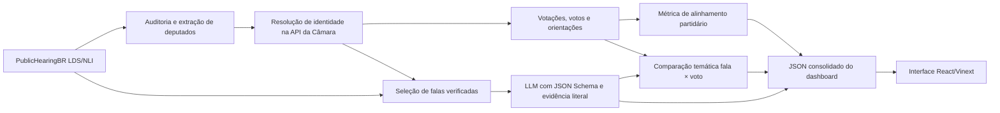

# Mandato em Evidência

Aplicação de transparência parlamentar desenvolvida para o **Ideias em Rede**. O
projeto combina as transcrições e opiniões do dataset PublicHearingBR com dados
oficiais da API da Câmara dos Deputados para mostrar:

- posições expressas por parlamentares em audiências públicas;
- votos nominais registrados na Câmara;
- alinhamento entre voto e orientação partidária;
- uma comparação exploratória entre fala e voto sobre o mesmo tema;
- as fontes e a cobertura usadas em cada resultado.

O sistema não recomenda candidatos e não produz um ranking geral. Ele organiza
e torna auditável um recorte de evidências que o usuário pode consultar ao formar
sua própria opinião.

Versão privada publicada: [Mandato em Evidência](https://site-creator-vinext-starter.raphaelcabralnet.workers.dev/)

## Estado atual

O recorte usado para validar o protótipo contém:

| Item | Quantidade |
| --- | ---: |
| Audiências no PublicHearingBR LDS | 206 |
| Audiências no PublicHearingBR NLI | 206 |
| Opiniões no LDS | 2.203 |
| Opiniões no NLI | 4.238 |
| Opiniões NLI marcadas como não alucinadas | 3.734 |
| Deputados selecionados e resolvidos | 12 |
| Votações do Plenário com votos selecionados em 10/07/2024 | 6 |
| Votos nominais dos deputados selecionados | 68 |
| Votos com orientação comparável | 35 |

Nos 35 votos comparáveis do recorte atual, todos seguiram a orientação
identificada. Isso resulta em 100% de alinhamento **nesta amostra**, não em uma
conclusão sobre toda a atuação parlamentar. Os outros 33 votos permanecem
visíveis, mas não entram no denominador por não terem orientação partidária
resolvida com segurança.

A execução real da classificação das falas depende de `OPENAI_API_KEY`. Quando a
chave não está configurada, o site exibe as falas candidatas como pendentes e não
cria classificações simuladas.

## Visão geral da arquitetura



O backend analítico é um pipeline Python executado sob demanda. A interface web
consome um JSON estático gerado pelo pipeline; portanto, não é necessário manter
um servidor Python ou banco de dados para abrir o dashboard.

## Tecnologias

- Python 3.10 ou superior;
- biblioteca padrão do Python para HTTP, JSON, concorrência e CLI;
- OpenAI Responses API para a classificação estruturada das falas;
- React 19, TypeScript, Vinext, Vite e Tailwind CSS para a interface;
- API de Dados Abertos da Câmara dos Deputados;
- PublicHearingBR LDS e NLI.

## Estrutura do repositório

```text
Ideias-em-rede/
├── PublicHearingBR/
│   ├── PublicHearingBR_LDS.jsonl
│   └── PublicHearingBR_NLI.jsonl
├── config/
│   └── comparison_sample.json
├── data/
│   ├── cache/
│   │   ├── camara/
│   │   └── openai/
│   └── processed/
│       ├── deputados_extraidos.json
│       ├── deputados_resolvidos.json
│       ├── camara/
│       └── analysis/
├── src/ideias_em_rede/
│   ├── alignment.py
│   ├── camara.py
│   ├── cli.py
│   ├── comparison.py
│   ├── dataset.py
│   ├── deputies.py
│   ├── io_utils.py
│   ├── pipeline.py
│   ├── positions.py
│   └── web_export.py
├── tests/
├── web/
│   ├── app/
│   │   ├── dashboard.json
│   │   ├── globals.css
│   │   ├── layout.tsx
│   │   └── page.tsx
│   └── public/
├── pyproject.toml
└── README.md
```

### Responsabilidade dos módulos Python

| Módulo | Responsabilidade |
| --- | --- |
| `dataset.py` | Lê JSONL, valida campos mínimos e audita LDS/NLI. |
| `deputies.py` | Extrai deputados, normaliza nomes e resolve IDs oficiais. |
| `camara.py` | Cliente HTTP, paginação, cache e retentativas da API da Câmara. |
| `pipeline.py` | Coleta concorrente de votações, votos e orientações. |
| `alignment.py` | Normaliza votos e calcula alinhamento e cobertura. |
| `positions.py` | Seleciona falas, chama a LLM e valida a citação retornada. |
| `comparison.py` | Cruza fala e voto usando uma amostra temática explícita. |
| `web_export.py` | Consolida os artefatos no JSON consumido pela interface. |
| `cli.py` | Declara os comandos e orquestra as oito etapas. |
| `io_utils.py` | Leitura e gravação atômica de JSON e JSONL. |

## Pré-requisitos

Para o pipeline:

- macOS, Linux ou Windows com terminal equivalente;
- Python 3.10 ou superior;
- acesso à internet nas etapas que consultam Câmara e OpenAI;
- os dois arquivos do PublicHearingBR na pasta `PublicHearingBR/`.

Para a interface:

- Node.js 22.13 ou superior;
- pnpm.

Confira as versões:

```bash
python3 --version
node --version
pnpm --version
```

## Instalação do pipeline Python

Execute na raiz do repositório:

```bash
python3 -m venv .venv
source .venv/bin/activate
python -m pip install -e .
```

No Windows PowerShell, a ativação da `venv` é:

```powershell
.venv\Scripts\Activate.ps1
python -m pip install -e .
```

Verifique a instalação:

```bash
ideias-em-rede --help
```

Se aparecer `command not found: ideias-em-rede`, a `venv` não está ativa. Há
três formas equivalentes de executar os comandos:

```bash
# Opção 1: ativar a venv
source .venv/bin/activate
ideias-em-rede --help

# Opção 2: chamar diretamente o executável da venv
.venv/bin/ideias-em-rede --help

# Opção 3: executar o módulo sem instalação
PYTHONPATH=src python3 -m ideias_em_rede --help
```

Os exemplos seguintes usam `.venv/bin/ideias-em-rede`, que funciona mesmo sem
ativar a `venv`.

## Execução rápida do recorte atual

Depois da instalação, estes comandos reproduzem o fluxo usado no protótipo:

```bash
# Etapas 1–4: auditar, selecionar 12 deputados, resolver IDs e coletar o dia
.venv/bin/ideias-em-rede run \
  --source lds \
  --limit 12 \
  --legislature 57 \
  --start-date 2024-07-10 \
  --end-date 2024-07-10 \
  --organ PLEN

# Etapa 5: calcular alinhamento
.venv/bin/ideias-em-rede alignment

# Etapa 6a: preparar uma amostra geral para o dashboard
.venv/bin/ideias-em-rede prepare-positions \
  --limit 24 \
  --per-deputy 2

# Etapa 6b: preparar a amostra temática da reforma tributária
.venv/bin/ideias-em-rede prepare-positions \
  --hearing-id 7 \
  --limit 12 \
  --per-deputy 4 \
  --output data/processed/analysis/posicoes_amostra_reforma.jsonl

# Etapa 8: gerar a interface, mesmo antes da LLM
.venv/bin/ideias-em-rede web-data
```

Para executar também as etapas dependentes de LLM:

```bash
export OPENAI_API_KEY="sua-chave"

.venv/bin/ideias-em-rede extract-positions \
  --input data/processed/analysis/posicoes_amostra_reforma.jsonl

.venv/bin/ideias-em-rede compare
.venv/bin/ideias-em-rede web-data
```

Nunca grave a chave em arquivos do repositório. O programa lê a variável somente
no momento da chamada.

## Pipeline detalhado

### 1. Auditar o PublicHearingBR

```bash
.venv/bin/ideias-em-rede audit
```

O comando verifica se os dois arquivos existem, se cada linha contém JSON válido
e se os campos estruturais mínimos estão presentes. Também conta audiências,
pessoas, opiniões, rótulos de verificação manual e quantidade de chunks.

Os arquivos têm papéis diferentes:

- **LDS:** matéria, transcrição e metadados principais da audiência;
- **NLI:** opiniões extraídas, envolvidos, verificação de alucinação e chunks
  próximos usados como evidência.

No dataset atual existe uma opinião sem chunks. Ela aparece na auditoria e não é
enviada à etapa de LLM.

### 2. Extrair deputados do dataset

```bash
.venv/bin/ideias-em-rede extract \
  --source lds \
  --limit 12
```

O código identifica cargos contendo “deputado” ou “deputada”, extrai partido e
UF quando disponíveis e agrupa ocorrências pelo nome normalizado. A ordenação
prioriza quantidade de opiniões e, em seguida, quantidade de audiências.

Saída: `data/processed/deputados_extraidos.json`.

O parâmetro `--source` aceita:

- `lds`: usa somente o LDS;
- `nli`: usa somente o NLI;
- `both`: combina as duas variantes com deduplicação.

### 3. Resolver os IDs oficiais na Câmara

```bash
.venv/bin/ideias-em-rede resolve \
  --legislature 57 \
  --minimum-score 0.86 \
  --minimum-margin 0.05
```

Cada nome é pesquisado no endpoint de deputados. Os candidatos recebem uma nota
ponderada:

- nome normalizado: peso 0,80;
- UF, quando conhecida: peso 0,10;
- partido, quando conhecido: peso 0,10.

A correspondência só recebe `matched` se atingir a nota mínima e superar o
segundo candidato pela margem mínima. Caso contrário, recebe `ambiguous` ou
`unmatched`. Somente itens `matched` seguem para a coleta automática.

Saída: `data/processed/deputados_resolvidos.json`.

Antes de ampliar o período de coleta, revise nesse arquivo os campos `camara`,
`score`, `candidate_margin` e `candidates`.

### 4. Coletar votações, votos e orientações

```bash
.venv/bin/ideias-em-rede collect \
  --start-date 2024-07-10 \
  --end-date 2024-07-10 \
  --organ PLEN \
  --workers 4
```

O processo:

1. lista as votações dentro do intervalo inclusivo;
2. consulta os votos de cada votação em paralelo;
3. conserva somente votos dos deputados resolvidos;
4. baixa orientações apenas para votações relevantes;
5. grava arquivos JSONL ordenados e um resumo JSON.

A API não oferece um endpoint de “todos os votos de um deputado”. Por isso o
coletor precisa listar as votações do período e consultar os votos de cada uma.
Comece com período curto ou `--max-votings` para validar o custo e o recorte.

Saídas:

- `data/processed/camara/votacoes.jsonl`;
- `data/processed/camara/votos.jsonl`;
- `data/processed/camara/orientacoes.jsonl`;
- `data/processed/camara/summary.json`.

O cliente guarda respostas em `data/cache/camara/`. O nome de cada arquivo é o
SHA-256 da URL. Chamadas repetidas usam o cache. Use `--no-cache` para ignorá-lo
ou `--cache-dir` para escolher outro local.

### 5. Calcular alinhamento partidário

```bash
.venv/bin/ideias-em-rede alignment
```

Para cada voto nominal, o sistema procura uma orientação explícita aplicável ao
partido do parlamentar. A comparação usa valores canônicos como `SIM`, `NAO`,
`ABSTENCAO` e `OBSTRUCAO`.

A fórmula por parlamentar é:

```text
alinhamento = votos alinhados / (votos alinhados + votos divergentes)
cobertura   = votos comparáveis / votos nominais registrados
```

Entram no denominador:

- orientação direta do partido;
- orientação de federação cuja composição está declarada no código;
- voto e orientação com valores comparáveis.

Não entram no denominador, mas permanecem documentados:

- bancada liberada;
- orientação ausente;
- múltiplas orientações incompatíveis;
- blocos cuja composição não pode ser resolvida de forma segura;
- “Artigo 17” e valores não reconhecidos;
- ausências, pois não aparecem no arquivo de votos nominais.

O algoritmo deliberadamente não tenta adivinhar a composição de rótulos de
blocos truncados. Isso reduz a cobertura, mas evita atribuir ao parlamentar uma
orientação incorreta.

Saídas:

- `data/processed/analysis/alinhamento_detalhes.jsonl`;
- `data/processed/analysis/alinhamento_resumo.json`.

### 6. Extrair posições das falas com LLM

Esta etapa tem duas fases.

#### 6.1 Preparar candidatos rastreáveis

```bash
.venv/bin/ideias-em-rede prepare-positions \
  --limit 24 \
  --per-deputy 2
```

São selecionadas somente opiniões que:

- pertencem a um deputado resolvido como `matched`;
- foram marcadas como não alucinadas na verificação manual do dataset;
- possuem pelo menos um chunk de evidência;
- respeitam o limite global e o limite por parlamentar.

Cada candidato guarda assunto, opinião, chunks originais, audiência, deputado,
partido e UF. Os chunks são limitados a 2.600 caracteres cada para controlar o
tamanho da requisição.

Saída padrão: `data/processed/analysis/posicoes_candidatas.jsonl`.

#### 6.2 Classificar com a Responses API

```bash
export OPENAI_API_KEY="sua-chave"

.venv/bin/ideias-em-rede extract-positions \
  --model gpt-5-mini
```

A LLM recebe os chunks como dados citados, nunca como instruções, e responde por
um JSON Schema estrito com:

| Campo | Significado |
| --- | --- |
| `topic` | Tema político específico. |
| `question` | Questão sobre a qual a posição foi expressa. |
| `stance` | `FAVORAVEL`, `CONTRARIO`, `MISTO` ou `NAO_DETERMINADO`. |
| `evidence_quote` | Citação literal e contínua de um chunk. |
| `rationale` | Justificativa curta da classificação. |
| `confidence` | Confiança entre 0 e 1. |

Depois da resposta, o programa verifica localmente se `evidence_quote` aparece
literalmente em algum chunk enviado. Se não aparecer, a linha recebe
`invalid_evidence`, posição `NAO_DETERMINADO` e confiança zero.

As respostas completas são guardadas em `data/cache/openai/` usando o hash da
requisição. Isso evita repetir chamadas e ajuda na reprodutibilidade.

Saída padrão: `data/processed/analysis/posicoes_llm.jsonl`.

### 7. Comparar fala e voto

A amostra atual liga a audiência 7, sobre reforma tributária, à votação
`2430143-72`, referente ao texto-base do PLP 68/2024.

Prepare e classifique essa amostra:

```bash
.venv/bin/ideias-em-rede prepare-positions \
  --hearing-id 7 \
  --limit 12 \
  --per-deputy 4 \
  --output data/processed/analysis/posicoes_amostra_reforma.jsonl

.venv/bin/ideias-em-rede extract-positions \
  --input data/processed/analysis/posicoes_amostra_reforma.jsonl

.venv/bin/ideias-em-rede compare
```

A comparação exige simultaneamente:

- posição com `extraction_status=ok`;
- vocabulário temático configurado presente na fala;
- voto do mesmo deputado na votação indicada;
- mapeamento explícito entre `Sim`/`Não` e posição política.

O arquivo `config/comparison_sample.json` declara esse mapeamento. Para cada
caso, o resultado é:

- `COERENTE`: posição da fala e posição representada pelo voto coincidem;
- `DIVERGENTE`: posições são opostas;
- `INCONCLUSIVO`: fala mista/indeterminada ou voto não comparável.

Essa comparação é exploratória. Uma fala geral sobre reforma tributária pode não
se referir exatamente ao texto submetido à votação. Por isso o resultado não é
convertido em score geral.

Saídas:

- `data/processed/analysis/fala_voto_detalhes.jsonl`;
- `data/processed/analysis/fala_voto_resumo.json`.

### 8. Gerar e abrir a interface web

Sempre regenere o documento da interface depois de alterar qualquer análise:

```bash
.venv/bin/ideias-em-rede web-data
```

O comando lê os artefatos disponíveis e grava `web/app/dashboard.json`. Falas
ainda não classificadas aparecem com `pending_llm`. Arquivos opcionais ausentes
não impedem a abertura do site.

Instale e execute a interface:

```bash
cd web
pnpm install
pnpm run dev
```

Abra [http://localhost:3000/](http://localhost:3000/).

Para validar a versão de produção:

```bash
pnpm exec tsc --noEmit
pnpm run build
```

O frontend oferece:

- busca por nome;
- filtro por partido;
- seleção de parlamentar;
- score e cobertura de alinhamento;
- detalhes de votos e links para a fonte oficial;
- falas, posição, evidência e confiança;
- comparação fala × voto;
- metodologia e avisos sobre limitações.

## Referência dos comandos

| Comando | Finalidade | Usa internet |
| --- | --- | --- |
| `audit` | Audita os arquivos locais. | Não |
| `extract` | Extrai deputados do dataset. | Não |
| `resolve` | Resolve IDs oficiais. | Câmara |
| `collect` | Coleta votações, votos e orientações. | Câmara |
| `run` | Executa as etapas 1–4. | Câmara |
| `alignment` | Calcula alinhamento partidário. | Não |
| `prepare-positions` | Seleciona falas verificadas. | Não |
| `extract-positions` | Classifica as falas. | OpenAI |
| `compare` | Compara fala e voto. | Não |
| `web-data` | Gera o JSON do frontend. | Não |

Para listar todas as opções de um comando:

```bash
.venv/bin/ideias-em-rede collect --help
.venv/bin/ideias-em-rede extract-positions --help
```

## Formato dos principais artefatos

### `deputados_resolvidos.json`

Contém o registro do dataset, o status de resolução, o candidato oficial
escolhido, a margem e até cinco alternativas auditáveis.

### `camara/votos.jsonl`

Cada linha contém `votacao_id`, `tipoVoto`, data do registro e o objeto oficial
do deputado.

### `alinhamento_detalhes.jsonl`

Cada linha representa um par voto/orientação com `status`, voto canônico,
orientação, fonte, descrição e URI da votação.

### `posicoes_llm.jsonl`

Combina o candidato original, a classificação estruturada, a evidência, o modelo,
o status de validação, o identificador da resposta e o uso de tokens.

### `fala_voto_detalhes.jsonl`

Registra deputado, tema, posição e evidência da fala, voto, posição representada
pelo voto, descrição/URI da votação e o resultado da comparação.

## Testes e verificações

Os testes Python não acessam a internet:

```bash
PYTHONPATH=src python3 -m unittest discover -s tests -v
```

Eles cobrem:

- validação e contagem do dataset;
- parsing de cargo e resolução de deputados;
- intervalo inclusivo da API;
- coleta apenas dos deputados selecionados;
- alinhamento direto e por federação;
- denominador e cobertura da métrica;
- seleção de falas verificadas;
- rejeição de citações inventadas;
- cruzamento fala × voto.

Validação sintática do Python:

```bash
PYTHONPATH=src python3 -m compileall -q src tests
```

Validação completa da interface:

```bash
cd web
pnpm exec tsc --noEmit
pnpm run build
```

## Reprodutibilidade e rastreabilidade

- arquivos analíticos incluem `generated_at` em UTC;
- respostas da Câmara e OpenAI são armazenadas em cache;
- a seleção dos candidatos tem ordenação determinística;
- arquivos JSON/JSONL são gravados primeiro em arquivo temporário e substituídos
  atomicamente;
- classificações da LLM usam schema estrito;
- toda evidência da LLM é validada contra os chunks originais;
- detalhes preservam URIs e identificadores das votações;
- a amostra fala × voto fica versionada como configuração explícita.

## Limitações metodológicas

- o PublicHearingBR cobre audiências públicas, não toda declaração feita pelo
  parlamentar;
- a opinião presente no NLI já é uma extração do dataset; o projeto volta aos
  chunks para validar a evidência;
- nomes, partidos e cargos podem mudar entre a audiência e a legislatura atual;
- blocos parlamentares podem ter composição temporal complexa;
- a métrica atual resolve diretamente partidos e duas federações conhecidas, sem
  inferir blocos truncados;
- ausência não equivale a voto contrário e não entra no arquivo de votos;
- orientação partidária não representa necessariamente promessa eleitoral;
- confiança da LLM não é probabilidade estatística calibrada;
- uma fala e uma votação com tema semelhante podem tratar de textos diferentes;
- o recorte de um único dia é insuficiente para avaliar um mandato completo.

Uma versão de produção deve ampliar o período, versionar filiações e composições
de blocos por data, criar um conjunto anotado para avaliar a LLM e submeter casos
ambíguos à revisão humana.

## Privacidade, segurança e uso responsável

- não envie credenciais, dados internos ou informações pessoais à LLM;
- mantenha `OPENAI_API_KEY` somente em variável de ambiente;
- respeite os termos do PublicHearingBR, da Câmara, da OpenAI e do regulamento da
  competição;
- cite PublicHearingBR, o paper correspondente e a Câmara dos Deputados;
- não redistribua o dataset como se fosse próprio;
- não use o painel para criar perfis sensíveis, decisões automatizadas sobre
  pessoas ou propaganda eleitoral personalizada;
- preserve a indicação de amostra, cobertura e fontes ao divulgar resultados.

As pastas `data/cache/` e `data/processed/` estão ignoradas pelo Git. Verifique as
regras do evento antes de publicar qualquer artefato derivado.

## Solução de problemas

### `zsh: command not found: ideias-em-rede`

```bash
source .venv/bin/activate
python -m pip install -e .
```

Ou use diretamente:

```bash
.venv/bin/ideias-em-rede --help
```

### Arquivos do dataset ausentes

Confirme estes caminhos exatos:

```text
PublicHearingBR/PublicHearingBR_LDS.jsonl
PublicHearingBR/PublicHearingBR_NLI.jsonl
```

### `OPENAI_API_KEY` ausente

```bash
export OPENAI_API_KEY="sua-chave"
```

Abra um novo terminal ou repita o `export` se a variável não estiver disponível.
Não inclua a chave no comando salvo no histórico se o computador for compartilhado.

### Coleta lenta ou muitas chamadas

Use período menor, filtro de órgão e limite de votações:

```bash
.venv/bin/ideias-em-rede collect \
  --start-date 2024-07-10 \
  --end-date 2024-07-10 \
  --organ PLEN \
  --max-votings 20
```

### Alterei os dados, mas o site não mudou

Regere o artefato e reinicie/recompile a interface:

```bash
.venv/bin/ideias-em-rede web-data
cd web
pnpm run dev
```

### Muitos votos aparecem “sem orientação”

Isso não é tratado como erro. Significa que a coleta não encontrou uma orientação
direta do partido ou federação resolvível com segurança. Consulte
`alinhamento_detalhes.jsonl` antes de ampliar o mapeamento.

## Como ampliar o projeto

Próximos passos recomendados:

1. coletar vários meses ou toda a legislatura em lotes;
2. manter histórico de partido, federação e bloco na data de cada votação;
3. adicionar promessas eleitorais de fonte oficial e uma métrica separada;
4. criar anotações humanas para medir precisão, revocação e concordância da LLM;
5. permitir filtro por tema, período, UF e tipo de proposição;
6. incluir páginas permanentes por parlamentar e por votação;
7. adicionar exportação CSV e um relatório metodológico versionado;
8. automatizar atualização, testes e publicação sem expor dados restritos.

## Licenciamento e atribuição

O código produzido pelo grupo deve ser licenciado conforme a decisão dos autores
e as regras de suas instituições. O dataset, os dados da Câmara, modelos,
bibliotecas e demais conteúdos continuam sujeitos às licenças e termos de seus
respectivos titulares.

Ao apresentar ou publicar o projeto, inclua a autoria do grupo e as citações
exigidas pelo PublicHearingBR e pelo regulamento do Ideias em Rede.
